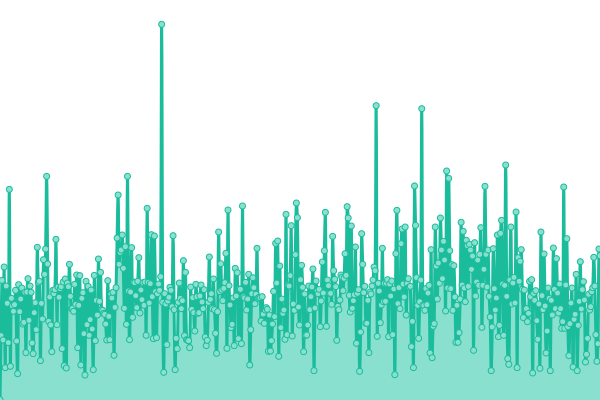
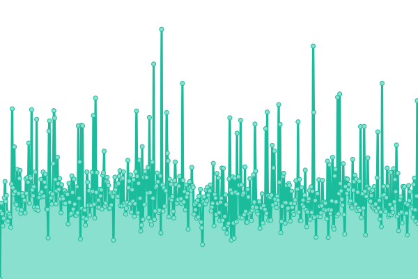
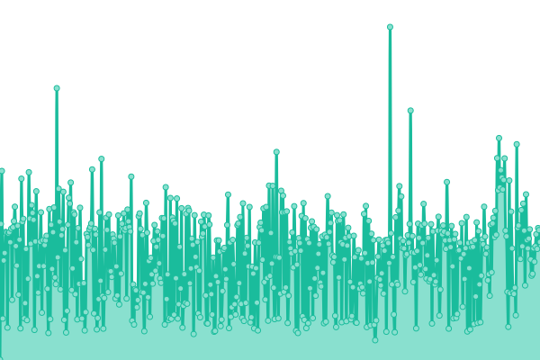
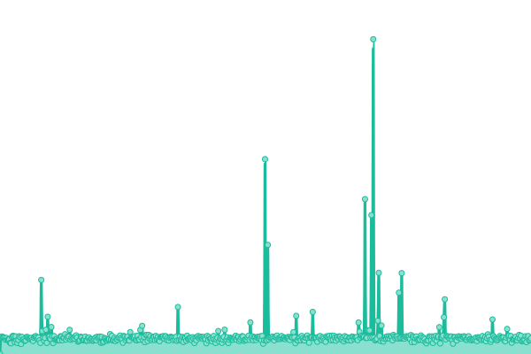
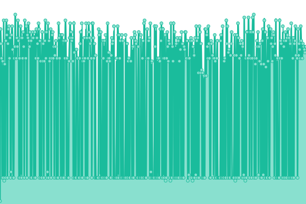
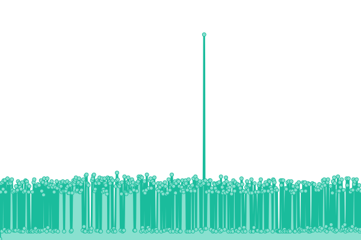

# [📈 实时状态](https://status.vrcd.org.cn): <!--live status--> **🟧 Partial outage**

This repository contains the open-source uptime monitor and status page for [VRCD](https://vrcd.org.cn), powered by [Upptime](https://github.com/upptime/upptime).

With [Upptime](https://upptime.js.org), you can get your own unlimited and free uptime monitor and status page, powered entirely by a GitHub repository. We use [Issues](https://github.com/vrcd-community/status/issues) as incident reports, [Actions](https://github.com/vrcd-community/status/actions) as uptime monitors, and [Pages](https://status.vrcd.org.cn) for the status page.

## [📈 Live Status](https://demo.upptime.js.org): <!--live status--> **🟧 Partial outage**

<!--start: status pages-->
<!-- This summary is generated by Upptime (https://github.com/upptime/upptime) -->
<!-- Do not edit this manually, your changes will be overwritten -->
<!-- prettier-ignore -->
| URL | Status | History | Response Time | Uptime |
| --- | ------ | ------- | ------------- | ------ |
|  [VRCD 官网](https://www.vrcd.org.cn) | 正常运行 | [vrcd.yml](https://github.com/vrcd-community/status/commits/HEAD/history/vrcd.yml) | 

 469ms
     
 | 

<a href="https://status.vrcd.org.cn/history/vrcd">100.00%</a>
    

|  [Developer Localization Project VRChat 汉化文档中心](https://docs.vrczh.org) | 正常运行 | [developer-localization-project-vr-chat.yml](https://github.com/vrcd-community/status/commits/HEAD/history/developer-localization-project-vr-chat.yml) | 

 360ms
     
 | 

<a href="https://status.vrcd.org.cn/history/developer-localization-project-vr-chat">100.00%</a>
    

|  [VPM Frontend 镜像站前端](https://vcc.vrczh.org) | 正常运行 | [vpm-frontend.yml](https://github.com/vrcd-community/status/commits/HEAD/history/vpm-frontend.yml) | 

 1159ms
     
 | 

<a href="https://status.vrcd.org.cn/history/vpm-frontend">100.00%</a>
    

|  [VPM API 镜像站后端](https://vpm.vrczh.org/vpm) | 正常运行 | [vpm-api.yml](https://github.com/vrcd-community/status/commits/HEAD/history/vpm-api.yml) | 

 459ms
     
 | 

<a href="https://status.vrcd.org.cn/history/vpm-api">73.97%</a>
    

|  [OSS 对象存储 (由雨云提供)](https://cn-sy1.rains3.com/vpm/ping) | 故障 | [oss.yml](https://github.com/vrcd-community/status/commits/HEAD/history/oss.yml) | 

 884ms
     
 | 

<a href="https://status.vrcd.org.cn/history/oss">12.30%</a>
    

|  WAF 1 | 正常运行 | [waf-1.yml](https://github.com/vrcd-community/status/commits/HEAD/history/waf-1.yml) | 

 40ms
     
 | 

<a href="https://status.vrcd.org.cn/history/waf-1">100.00%</a>
    

|  WAF 2 | 故障 | [waf-2.yml](https://github.com/vrcd-community/status/commits/HEAD/history/waf-2.yml) | 

 0ms
     
 | 

<a href="https://status.vrcd.org.cn/history/waf-2">100.00%</a>
    

<!--end: status pages-->

[**Visit our status website →**](https://status.vrcd.org.cn)

## 📄 License

- Powered by: [Upptime](https://github.com/upptime/upptime)
- Code: [MIT](./LICENSE) © [Anand Chowdhary](https://anandchowdhary.com), supported by [Pabio](https://pabio.com)
- Data in the `./history` directory: [Open Database License](https://opendatacommons.org/licenses/odbl/1-0/)
